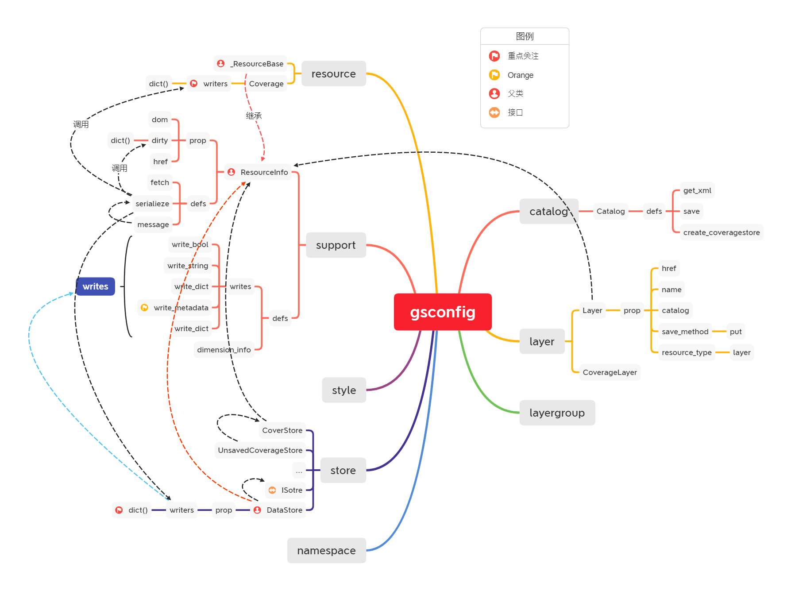
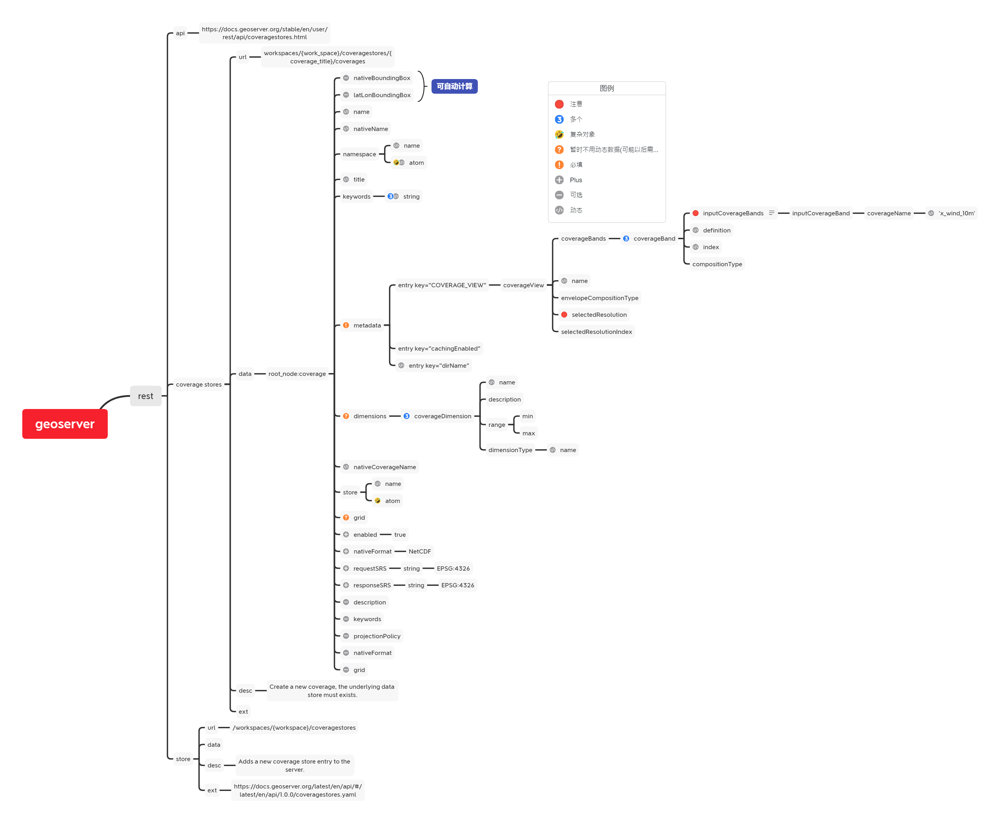

# 大致介绍

本项目fork自[[planetfederal/gsconfig](https://github.com/planetfederal/gsconfig)]  

由于 `gsconfig` 主要是基于py2开发的，虽然之后支持了py3，但是整体思路是以py2为主题，所以没有py3之后的 abc等抽象的思想，之前考虑过基于 源码直接进行拓展，后放弃此想法。直接拓展部分业务，尽量不修改源码。

对于源码进行了部分改造，增加了部分源码的注释，可以参考其中的 **TODO** 标签。

增加了coverage 对 netcdf的支持

除了对于部分源码的修改，还增加了部分符合也业务需求的自定义 类，参考```customer_xx.py```


---

参与人员 :*排名不分先后*

[evaseemefly](https://github.com/evaseemefly)

[cwb](https://github.com/tongtong1121)

进度安排(20-03-31之后放在此处):

[进去安排](my-document/schedule.md)

---

## 项目结构

```
|__ geoserver
	|__ conf/     			---部分配置文件
	|__ case.py
	|__ catalog.py
	|__ layer.py
	|__ layergroup.py
	|__ namespace.py
	|__ store.py
	|__ style.py
	|__ support.py
	|__ util.py
	|__ workspace.py		--- 以上部分为gsconfig的源代码，对其中部分代码加入了部分改造
	|__ common.py			--- 自定义 `error` 以及其他公用方法
	|__ customer_base.py	---
		|__ BaseCatalog     --- 所有的 customer_xx 均需要继承的基础父类
	|__ customer_layer.py	--- 自定义的 layer
		|__ CoverageLayer	--- 栅格 layer 主要封装了需要提交的 xml 各个 node 
	|__ customer_store.py	--- 自定义的 store
		|__ CoverageNcStore	--- nc store 的发布相关的封装
	|__ customer_style.py	--- 需要发布的样式 style
		|__ BaseStyle
		|__ LayerStyle
	|__ case.py				--- 所有的 test case均放置此处
```

---

## gs 源码的体系:

[gsconfig]()



